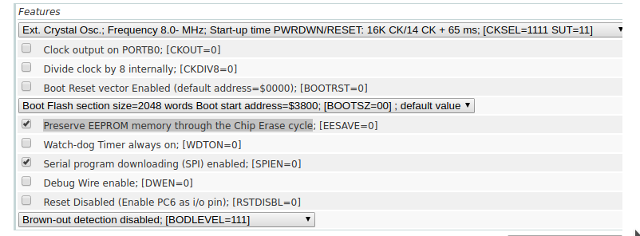

# Bed Sensor

## Background


This sensor is built around the open source schematic of the Ardunio Pro Mini and the seperate parts we're tested sepertly and the final board was printed from [oshPark](https://oshpark.com/). This is an experemential sensor that makes sure patients roll over within a fixed interval. The model uses a state machine with two states: COUNTING_STATE, and a ROTATING_STATE. The counting state samples the direction of the acceleration vector and during the ROTATING_STATE, the arc angle between the current vector and the sampled data from the counting state determins the rotation of the device from the resting state. A average filter is sampled from the current resting angle of the sensor is sampled by taking 20% of the current sample vector and 80% of the current resting angle. This is a mitigation strategy that avoids sampling from sudden movments and affecting the angle of the sensor. The counting state is reset if the devaition from the scalar vector is greater then .35 g's.  

## Programming

scons build 

```avrdude -c <programmer> -p atmega328 -b 57600  -U flash:w:main.hex -U lfuse:w:0xff:m -U hfuse:w:0xd1:m -U efuse:w:0xff:m```



[Fuse Calculator](http://eleccelerator.com/fusecalc/fusecalc.php?chip=atmega328p)


## Maintainers

The current maintainers of this repository are:

* Michael Pollind <polli104@mail.chapman.edu>


# License

```
/**
* Copyright 2018 GaitRehabilitation
*
* Licensed under the Apache License, Version 2.0 (the "License");
* you may not use this file except in compliance with the License.
* You may obtain a copy of the License at
*
*     http://www.apache.org/licenses/LICENSE-2.0
*
* Unless required by applicable law or agreed to in writing, software
* distributed under the License is distributed on an "AS IS" BASIS,
* WITHOUT WARRANTIES OR CONDITIONS OF ANY KIND, either express or implied.
* See the License for the specific language governing permissions and
* limitations under the License.
*/

```
